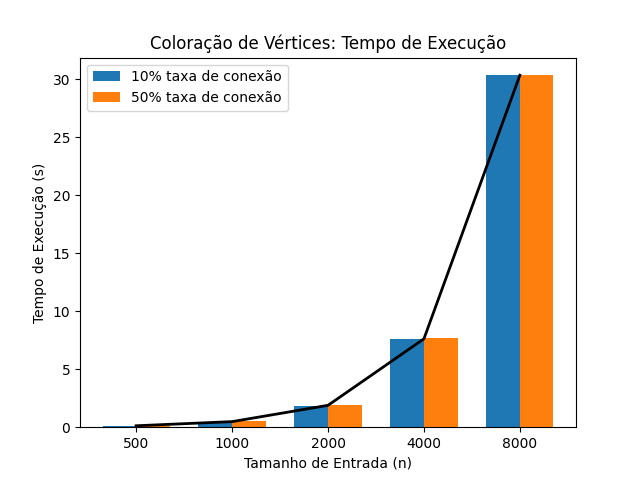

# Problema escolhido: Coloração de Vértices

Este problema consiste basicamente em colorir, uma única vez, cada vértice do grafo de modo que vértices dividindo a mesma aresta não compartilhem a mesma cor.

O método utilizado foi um algoritmo guloso.

Taxa de formação de vértices: $10\%$ e $50\%$ do tamanho da entrada($n$).

Tamanhos de entrada testados: $500, 800, 1000, 1200, 1400, 1600, 1800, 3000, 5000$.

Complexidade: $O(n^2)$.

## Resultados

As execuções do algoritmo mostraram tempo de execução muito próximos em relação à taxa de conexões, embora demonstre que quanto maior a taxa, maior o tempo de execução. Não parando por aí, o número de cores necessárias para conclusão do algoritmo está diretamente ligada ao número de conexões:

| Taxa de Conexão (%) | Número de cores necessárias|
|:--:|:--:|
| 10 | 11 |
| 50 | 31 |

